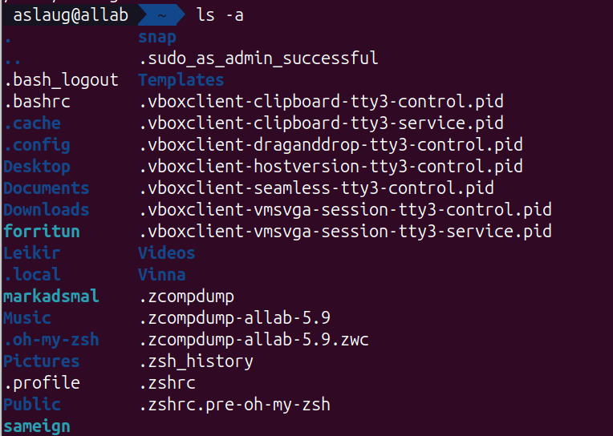

# KEST1VL project

this repository contains all files fro the KEST1VL linux setup project.

## screenshots
screenshots will show:
- folder structure (/GÖGN)
- /etc/passwd
- /etc/shadow
- /etc/group
- /etc/skel
- Álaug,s home directory

## files

- commands.txt
- dagbok.txt
- instructions_for_aslaug.txt

## Folder Tree of /GÖGN

## /etc/passwd

## /etc/shadow

## /etc/group

## /etc/skel listing

## Áslaug's Home Folder

